# Redmine ONLYOFFICE Integration Plugin

This plugin enables users to edit attachments from [Redmine](https://www.redmine.org/) using ONLYOFFICE Docs packaged as Document Server — [Community or Enterprise Edition](#onlyoffice-docs-editions).

## Features

- View and edit text documents, spreadsheets, presentations, and forms.
- Co-edit in real-time, with options for both fast and strict modes. It also tracks changes, allows comments, and provides a built-in chat.
- Settings page to setup JWT authentication, customize the appearance of the editor appearance and connection to it.
- Mobile view for licensed editors.
- Create new attachment using templates that consider the user's language preference.
- Convert attachment and save or download them.

### Supported formats

<!-- DO NOT EDIT MANUALLY, THE TABLE IS GENERATED AUTOMATICALLY -->
<!-- def-formats -->
| |djvu|doc|docm|docx|docxf|dot|dotm|dotx|epub|fb2|fodt|htm|html|mht|mhtml|odt|oform|ott|oxps|pdf|rtf|stw|sxw|txt|wps|wpt|xml|xps|csv|et|ett|fods|ods|ots|sxc|xls|xlsb|xlsm|xlsx|xlt|xltm|xltx|dps|dpt|fodp|odp|otp|pot|potm|potx|pps|ppsm|ppsx|ppt|pptm|pptx|sxi|
|:-|:-:|:-:|:-:|:-:|:-:|:-:|:-:|:-:|:-:|:-:|:-:|:-:|:-:|:-:|:-:|:-:|:-:|:-:|:-:|:-:|:-:|:-:|:-:|:-:|:-:|:-:|:-:|:-:|:-:|:-:|:-:|:-:|:-:|:-:|:-:|:-:|:-:|:-:|:-:|:-:|:-:|:-:|:-:|:-:|:-:|:-:|:-:|:-:|:-:|:-:|:-:|:-:|:-:|:-:|:-:|:-:|:-:|
|View|+|+|+|+|+|+|+|+|+|+|+|+|+|+|+|+|+|+|+|+|+|+|+|+|+|+|+|+|+|+|+|+|+|+|+|+|+|+|+|+|+|+|+|+|+|+|+|+|+|+|+|+|+|+|+|+|+|
|Edit|-|-|+|+|+|-|+|+|+-|+-|-|-|+-|-|-|+-|+|+-|-|-|+-|-|-|+-|-|-|-|-|+-|-|-|-|+-|+-|-|-|-|+|+|-|+|+|-|-|-|+-|+-|-|+|+|-|+|+|-|+|+|-|
|Create|-|-|-|+|+|-|-|-|-|-|-|-|-|-|-|-|-|-|-|-|-|-|-|-|-|-|-|-|-|-|-|-|-|-|-|-|-|-|+|-|-|-|-|-|-|-|-|-|-|-|-|-|-|-|-|+|-|
<!-- end-formats -->

## Installing ONLYOFFICE Docs

Before you proceed to install the plugin, make sure you have an instance of ONLYOFFICE Docs (Document Server) that is resolvable and connectable both from Redmine and any end clients. Additionally, ensure that ONLYOFFICE Docs can directly POST to Redmine.

ONLYOFFICE Docs has the free Community version and scalable Enterprise Edition with pro features. You can read about [their differences](#onlyoffice-docs-editions) below.

We recommend using [Docker](https://github.com/onlyoffice/Docker-DocumentServer) to install the free Community version. Alternatively, you can follow [these instructions](https://helpcenter.onlyoffice.com/installation/docs-community-install-ubuntu.aspx) for Debian, Ubuntu, or derivatives.

To install Enterprise Edition, follow [these instructions](https://helpcenter.onlyoffice.com/installation/docs-enterprise-index.aspx).

## Installing Redmine ONLYOFFICE Integration Plugin

To install the plugin, you will need Redmine version 4.2 or higher, or version 5.0 or higher. It is also important to note that the plugin is compatible with Ruby version 2.7.2 or higher, or 3.0.0 or higher. We recommend using Redmine 5 along with Ruby 3.

If you are new to Redmine, install it by following [these instructions](https://www.redmine.org/projects/redmine/wiki/RedmineInstall).

Once you have installed Redmine, [download the plugin](https://github.com/ONLYOFFICE/onlyoffice-redmine/releases) and unzip it into the plugins directory.

```sh
$ curl --location https://github.com/ONLYOFFICE/onlyoffice-redmine/releases/latest/download/onlyoffice_redmine.tar.zst --output onlyoffice_redmine.tar.zst
$ tar --extract --file onlyoffice_redmine.tar.zst --directory plugins
```

Install the dependencies of the plugin if Redmine did not do it automatically.

```sh
$ bundle install
```

Perform the migration.

```sh
$ RAILS_ENV=production bundle exec rake redmine:plugins:migrate NAME=onlyoffice_redmine
```

And finally, restart Redmine. Read more about the installation of the plugin on the Redmine [Wiki page](https://www.redmine.org/projects/redmine/wiki/Plugins#Installing-a-plugin).

## Configuring Redmine ONLYOFFICE Integration Plugin

<details>
  <summary>Show settings page of the plugin</summary>

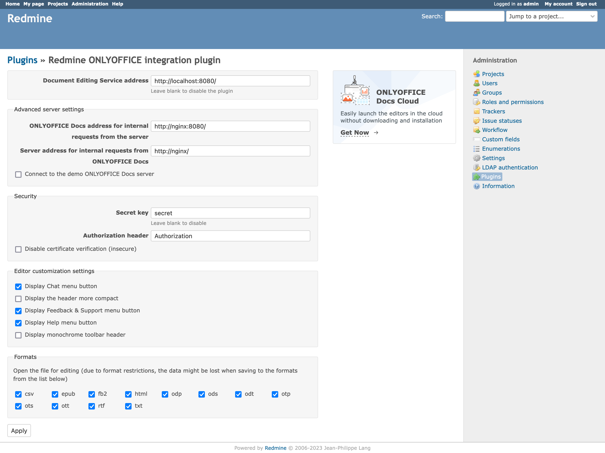

</details>

### General Settings

- Document Editing Service address. \
  The URL of the install ONLYOFFICE Document Server. Leave blank to disable the plugin.

### Advanced Server Settings

- ONLYOFFICE Docs address for internal requests from the server.
- Server address for internal requests from ONLYOFFICE Docs.
- Connect to the demo ONLYOFFICE Docs server.

### Security

- Secret key. \
  Starting from ONLYOFFICE Document Server 7.2, JWT authentication is enabled by default and the secret key is generated automatically to restrict the access to ONLYOFFICE Docs and for security reasons and data integrity. Specify your secret key in the ONLYOFFICE Docs [config file](https://api.onlyoffice.com/editors/signature/), then specify the same key in the settings page of the plugin. Leave blank to disable authentication.
- Authorization header.
- Disable certificate verification (insecure).

### Editor customization settings

- Display Chat menu button.
- Display the header more compact.
- Display Feedback & Support menu button.
- Display Help menu button.
- Display monochrome toolbar header.

### Formats

- Specify the list of formats allowed to editing.

## How It Works

The plugin uses the [ONLYOFFICE Docs API](https://api.onlyoffice.com/editors/basic) and is integrated into various Redmine pages, including [Documents](#documents), [Attachments](#attachment), [Files](#files), [Issue](#issue), [News](#news), [Wiki](#wiki), and [Forums](#forums). Additionally, the plugin adds general pages such as ["Create In ONLYOFFICE"](#create-in-onlyoffice) and ["Convert In ONLYOFFICE"](#convert-in-onlyoffice).

### Documents

<details>
  <summary>Show documents page</summary>

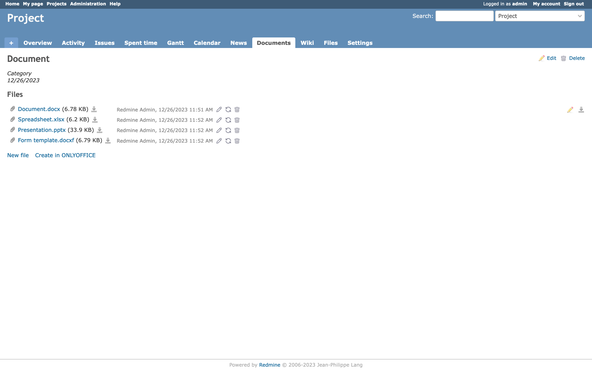

</details>

On the document page, the user can open the attachment to view, edit, create, or convert it. The options displayed in the interface may vary depending on the user's permissions.

| Option            | Permissions                    |
| ----------------- | ------------------------------ |
| View              | View documents                 |
| Edit              | View documents, Edit documents |
| Create            | View documents, Edit documents |
| Convert: Save     | View documents, Edit documents |
| Convert: Download | View documents                 |

### Attachment

<details>
  <summary>Show attachment page</summary>

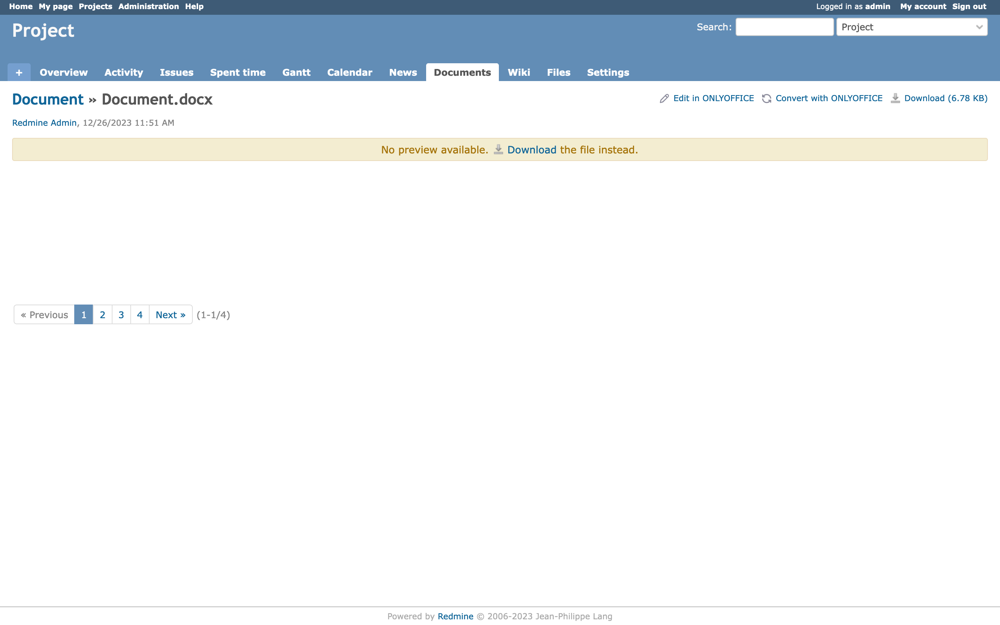

</details>

On the attachment page, the user can open the attachment to view, edit, or convert it. The options displayed in the interface may vary depending on the user's permissions for the module where the attachment is located.

### Files

<details>
  <summary>Show files page</summary>

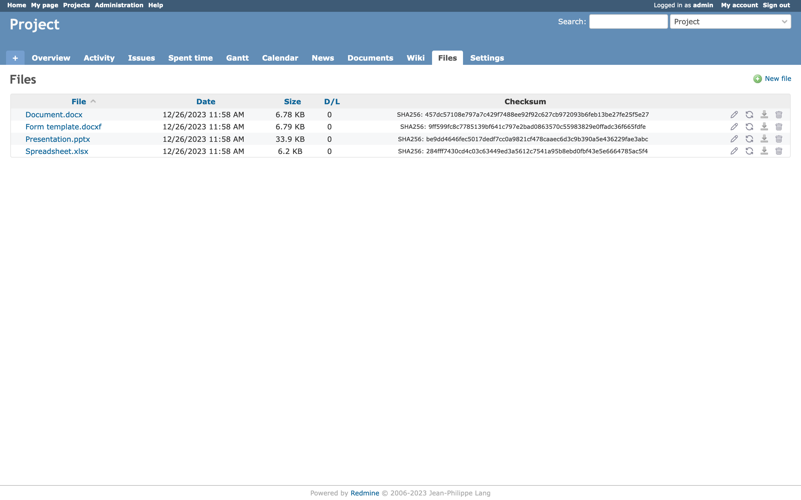

</details>

On the files page, the user can open the attachment to view, edit, or convert it. The options displayed in the interface may vary depending on the user's permissions.

| Option            | Permissions              |
| ----------------- | ------------------------ |
| View              | View files               |
| Edit              | View files, Manage files |
| Convert: Save     | View files, Manage files |
| Convert: Download | View files               |

### Issue

<details>
  <summary>Show issue page</summary>

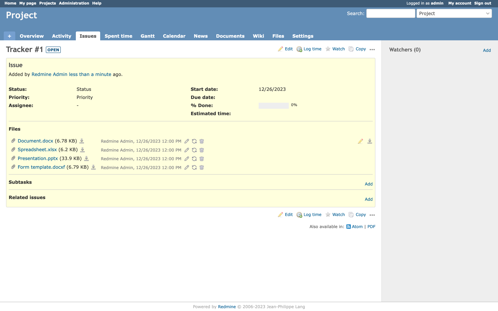

</details>

On the issue page, the user can open the attachment to view, edit, or convert it. The options displayed in the interface may vary depending on the user's permissions.

| Option            | Permissions                  |
| ----------------- | ---------------------------- |
| View              | View issues                  |
| Edit              | View issues, Edit own issues |
| Convert: Save     | View issues, Edit own issues |
| Convert: Download | View issues                  |

### News

<details>
  <summary>Show news page</summary>

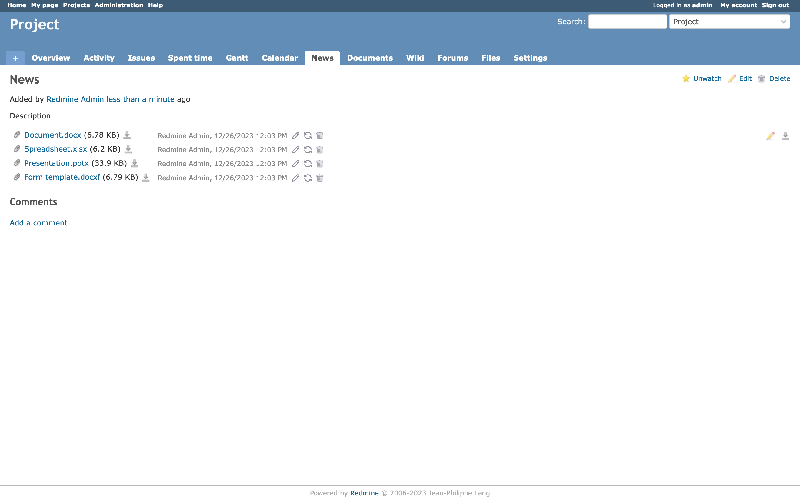

</details>

On the news page, the user can open the attachment to view, edit, or convert it. The options displayed in the interface may vary depending on the user's permissions.

| Option            | Permissions            |
| ----------------- | ---------------------- |
| View              | View news              |
| Edit              | View news, Manage news |
| Convert: Save     | View news, Manage news |
| Convert: Download | View news              |

### Wiki

<details>
  <summary>Show wiki page</summary>

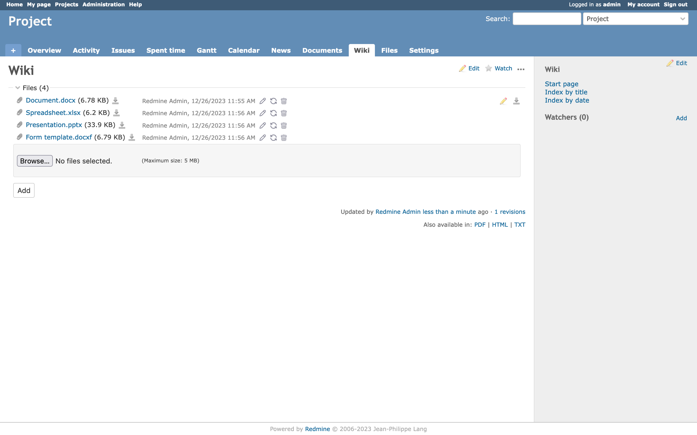

</details>

On the wiki page, the user can open the attachment to view, edit, or convert it. The options displayed in the interface may vary depending on the user's permissions.

| Option            | Permissions                |
| ----------------- | -------------------------- |
| View              | View wiki                  |
| Edit              | View wiki, Edit wiki pages |
| Convert: Save     | View wiki, Edit wiki pages |
| Convert: Download | View wiki                  |

### Forums

<details>
  <summary>Show forums page</summary>

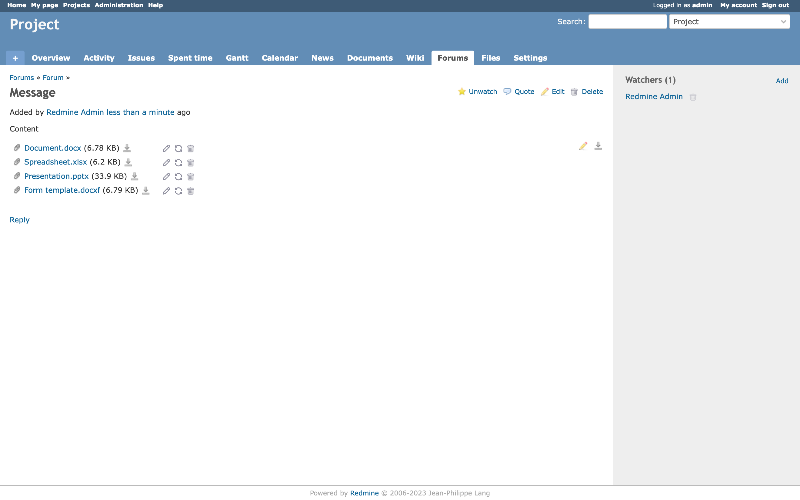

</details>

On the forums page, the user can open the attachment to view, edit, or convert it. The options displayed in the interface may vary depending on the user's permissions.

| Option            | Permissions                  |
| ----------------- | ---------------------------- |
| View              | View messages                |
| Edit              | View messages, Edit messages |
| Convert: Save     | View messages, Edit messages |
| Convert: Download | View messages                |

### View Or Edit In ONLYOFFICE

<details>
  <summary>Show editor page</summary>

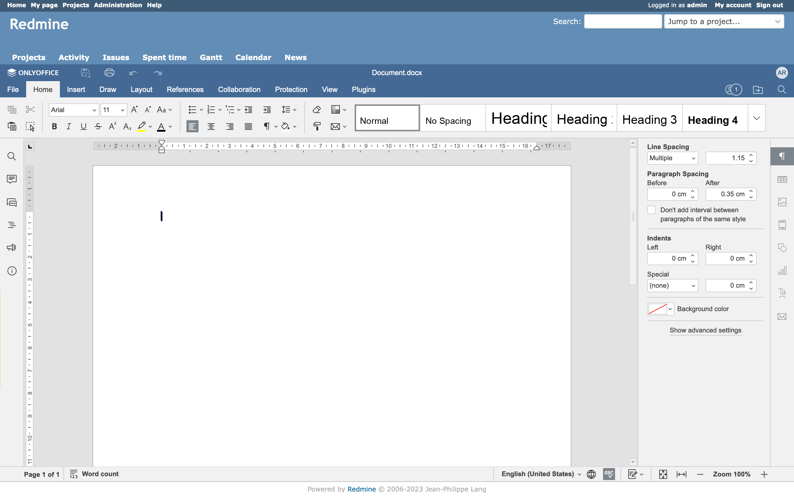

</details>

On the "View Or Edit In ONLYOFFICE" page, the user can view or edit the attachment. The visibility of this page depends on the user's permissions for the module where the attachment is located.

### Create In ONLYOFFICE

<details>
  <summary>Show create page</summary>

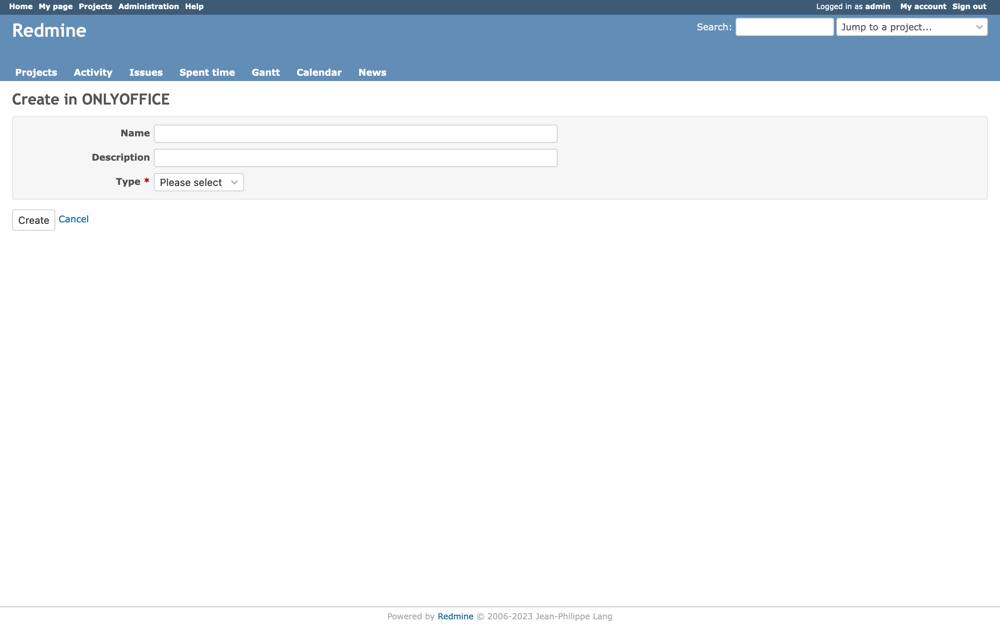

</details>

On the "Create In ONLYOFFICE" page, the user can create the attachment using templates that consider the user's language preference. Take a look at [supported formats](#supported-formats). The visibility of this page depends on the user's permissions for the module.

### Convert In ONLYOFFICE

<details>
  <summary>Show convert page</summary>

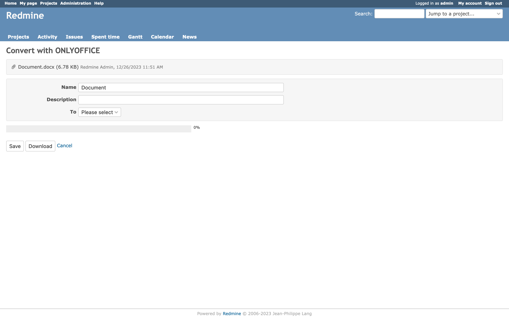

</details>

On the "Convert In ONLYOFFICE" page, the user can convert the attachment. The visibility of this page depends on the user's permissions for the module where the attachment is located.

## ONLYOFFICE Docs Editions

ONLYOFFICE offers different versions of ONLYOFFICE Docs editors that can be deployed on your own servers:

- Community Edition: `onlyoffice-documentserver` package.
- Enterprise Edition: `onlyoffice-documentserver-ee` package.

The table below will help you make the right choice.

| Pricing and licensing                              | Community Edition                                                                       | Enterprise Edition                                                                       |
| -------------------------------------------------- | --------------------------------------------------------------------------------------- | ---------------------------------------------------------------------------------------- |
|                                                    | [Get it now](https://www.onlyoffice.com/download-docs.aspx#docs-community)              | [Start Free Trial](https://www.onlyoffice.com/download-docs.aspx#docs-enterprise)        |
| Cost                                               | FREE                                                                                    | [Go to the pricing page](https://www.onlyoffice.com/docs-enterprise-prices.aspx)         |
| Simultaneous connections                           | up to 20 maximum                                                                        | As in chosen pricing plan                                                                |
| Number of users                                    | up to 20 recommended                                                                    | As in chosen pricing plan                                                                |
| License                                            | GNU AGPL v.3                                                                            | Proprietary                                                                              |
| **Support**                                        | **Community Edition**                                                                   | **Enterprise Edition**                                                                   |
| Documentation                                      | [Help Center](https://helpcenter.onlyoffice.com/installation/docs-community-index.aspx) | [Help Center](https://helpcenter.onlyoffice.com/installation/docs-enterprise-index.aspx) |
| Standard support                                   | [GitHub](https://github.com/ONLYOFFICE/DocumentServer/issues) or paid                   | One year support included                                                                |
| Premium support                                    | [Contact us](mailto:sales@onlyoffice.com)                                               | [Contact us](mailto:sales@onlyoffice.com)                                                |
| **Services**                                       | **Community Edition**                                                                   | **Enterprise Edition**                                                                   |
| Conversion Service                                 | +                                                                                       | +                                                                                        |
| Document Builder Service                           | +                                                                                       | +                                                                                        |
| **Interface**                                      | **Community Edition**                                                                   | **Enterprise Edition**                                                                   |
| Tabbed interface                                   | +                                                                                       | +                                                                                        |
| Dark theme                                         | +                                                                                       | +                                                                                        |
| 125%, 150%, 175%, 200% scaling                     | +                                                                                       | +                                                                                        |
| White Label                                        | -                                                                                       | -                                                                                        |
| Integrated test example (node.js)                  | +                                                                                       | +                                                                                        |
| Mobile web editors                                 | -                                                                                       | +*                                                                                       |
| **Plugins & Macros**                               | **Community Edition**                                                                   | **Enterprise Edition**                                                                   |
| Plugins                                            | +                                                                                       | +                                                                                        |
| Macros                                             | +                                                                                       | +                                                                                        |
| **Collaborative capabilities**                     | **Community Edition**                                                                   | **Enterprise Edition**                                                                   |
| Two co-editing modes                               | +                                                                                       | +                                                                                        |
| Comments                                           | +                                                                                       | +                                                                                        |
| Built-in chat                                      | +                                                                                       | +                                                                                        |
| Review and tracking changes                        | +                                                                                       | +                                                                                        |
| Display modes of tracking changes                  | +                                                                                       | +                                                                                        |
| Version history                                    | +                                                                                       | +                                                                                        |
| **Document Editor features**                       | **Community Edition**                                                                   | **Enterprise Edition**                                                                   |
| Font and paragraph formatting                      | +                                                                                       | +                                                                                        |
| Object insertion                                   | +                                                                                       | +                                                                                        |
| Adding Content control                             | +                                                                                       | +                                                                                        |
| Editing Content control                            | +                                                                                       | +                                                                                        |
| Layout tools                                       | +                                                                                       | +                                                                                        |
| Table of contents                                  | +                                                                                       | +                                                                                        |
| Navigation panel                                   | +                                                                                       | +                                                                                        |
| Mail Merge                                         | +                                                                                       | +                                                                                        |
| Comparing Documents                                | +                                                                                       | +                                                                                        |
| **Spreadsheet Editor features**                    | **Community Edition**                                                                   | **Enterprise Edition**                                                                   |
| Font and paragraph formatting                      | +                                                                                       | +                                                                                        |
| Object insertion                                   | +                                                                                       | +                                                                                        |
| Functions, formulas, equations                     | +                                                                                       | +                                                                                        |
| Table templates                                    | +                                                                                       | +                                                                                        |
| Pivot tables                                       | +                                                                                       | +                                                                                        |
| Data validation                                    | +                                                                                       | +                                                                                        |
| Conditional formatting                             | +                                                                                       | +                                                                                        |
| Sparklines                                         | +                                                                                       | +                                                                                        |
| Sheet Views                                        | +                                                                                       | +                                                                                        |
| **Presentation Editor features**                   | **Community Edition**                                                                   | **Enterprise Edition**                                                                   |
| Font and paragraph formatting                      | +                                                                                       | +                                                                                        |
| Object insertion                                   | +                                                                                       | +                                                                                        |
| Transitions                                        | +                                                                                       | +                                                                                        |
| Animations                                         | +                                                                                       | +                                                                                        |
| Presenter mode                                     | +                                                                                       | +                                                                                        |
| Notes                                              | +                                                                                       | +                                                                                        |
| **Form creator features**                          | **Community Edition**                                                                   | **Enterprise Edition**                                                                   |
| Adding form fields                                 | +                                                                                       | +                                                                                        |
| Form preview                                       | +                                                                                       | +                                                                                        |
| Saving as PDF                                      | +                                                                                       | +                                                                                        |
| **Working with PDF**                               | **Community Edition**                                                                   | **Enterprise Edition**                                                                   |
| Text annotations (highlight, underline, cross out) | +                                                                                       | +                                                                                        |
| Comments                                           | +                                                                                       | +                                                                                        |
| Freehand drawings                                  | +                                                                                       | +                                                                                        |
| Form filling                                       | +                                                                                       | +                                                                                        |
|                                                    | [Get it now](https://www.onlyoffice.com/download-docs.aspx#docs-community)              | [Start Free Trial](https://www.onlyoffice.com/download-docs.aspx#docs-enterprise)        |

\* If supported by DMS.
