# ONLYOFFICE plugin for Redmine

A clean, production-ready plugin that lets [Redmine](https://www.redmine.org/) users view, create, convert, and co-edit office files inside Redmine using [ONLYOFFICE Docs](https://www.onlyoffice.com/docs) (Document Server).

## Features ⭐

- Viewing and editing text documents, spreadsheets, presentations, and PDF forms.
- Co-editing documents in real time using two co-editing modes (Fast and Strict), Track Changes, comments, built-in chat.
- Settings page to set up connection to the server and JWT authentication, customize the editor's appearance.
- Mobile view for licensed editors.
- Creating new attachments using templates that consider the user's language preference.
- Converting attachments and saving or downloading them.

<p align="center">
  <a href="https://www.onlyoffice.com/office-for-redmine">
    
  </a>
</p>

### Supported formats

<!-- DO NOT EDIT MANUALLY, THE TABLE IS GENERATED AUTOMATICALLY -->
<!-- def-formats -->
| |djvu|doc|docm|docx|docxf|dot|dotm|dotx|epub*|fb2*|fodt|htm|html*|mht|mhtml|odt*|oform|ott*|oxps|pdf|rtf*|stw|sxw|txt*|wps|wpt|xml|xps|csv*|et|ett|fods|ods*|ots*|sxc|xls|xlsb|xlsm|xlsx|xlt|xltm|xltx|dps|dpt|fodp|odp*|otp*|pot|potm|potx|pps|ppsm|ppsx|ppt|pptm|pptx|sxi|
|:-|:-:|:-:|:-:|:-:|:-:|:-:|:-:|:-:|:-:|:-:|:-:|:-:|:-:|:-:|:-:|:-:|:-:|:-:|:-:|:-:|:-:|:-:|:-:|:-:|:-:|:-:|:-:|:-:|:-:|:-:|:-:|:-:|:-:|:-:|:-:|:-:|:-:|:-:|:-:|:-:|:-:|:-:|:-:|:-:|:-:|:-:|:-:|:-:|:-:|:-:|:-:|:-:|:-:|:-:|:-:|:-:|:-:|
|View|+|+|+|+|+|+|+|+|+|+|+|+|+|+|+|+|+|+|+|+|+|+|+|+|+|+|+|+|+|+|+|+|+|+|+|+|+|+|+|+|+|+|+|+|+|+|+|+|+|+|+|+|+|+|+|+|+|
|Edit|-|-|+|+|+|-|+|+|+|+|-|-|+|-|-|+|-|+|-|+|+|-|-|+|-|-|-|-|+|-|-|-|+|+|-|-|-|+|+|-|+|+|-|-|-|+|+|-|+|+|-|+|+|-|+|+|-|
|Create|-|-|-|+|+|-|-|-|-|-|-|-|-|-|-|-|-|-|-|-|-|-|-|-|-|-|-|-|-|-|-|-|-|-|-|-|-|-|+|-|-|-|-|-|-|-|-|-|-|-|-|-|-|-|-|+|-|
<!-- end-formats -->

\* To be able to open the format for editing, check it in the [formats settings](#formats). Due to some format restrictions, data loss may occur.

## Installing ONLYOFFICE Docs

Before you proceed to the plugin installation, make sure you have an instance of [ONLYOFFICE Docs](https://www.onlyoffice.com/docs) (Document Server) that is resolvable and connectable both from Redmine and any end clients. Additionally, ensure that ONLYOFFICE Docs can directly POST to Redmine.

You can install free Community version of ONLYOFFICE Docs or scalable Enterprise Edition.

To install **free Community version**, use [Docker](https://github.com/onlyoffice/Docker-DocumentServer) (recommended) or follow [these instructions](https://helpcenter.onlyoffice.com/docs/installation/docs-community-install-ubuntu.aspx) for Debian, Ubuntu, or derivatives.

To install **Enterprise Edition**, follow instructions [here](https://helpcenter.onlyoffice.com/docs/installation/enterprise).

The Community Edition vs Enterprise Edition comparison can be found [here](#onlyoffice-docs-editions).

Alternatively, you can opt for **ONLYOFFICE Docs Cloud** which doesn't require downloading and installation. To get ONLYOFFICE Docs Cloud, get started [here](https://www.onlyoffice.com/docs-registration).

## Plugin installation 📥

To install the plugin, you will need Redmine version 4.2 or higher, or version 5.0 or higher. It is also important to note that the plugin is compatible with Ruby version 2.7.2 or higher, or 3.0.0 or higher. We recommend using Redmine 5 along with Ruby 3.

Additionally, you may need [zstd](https://github.com/facebook/zstd) to unzip the plugin.

If you are new to Redmine, install it by following [these instructions](https://www.redmine.org/projects/redmine/wiki/RedmineInstall).

Once you have installed Redmine, [download the plugin](https://github.com/ONLYOFFICE/onlyoffice-redmine/releases).

```sh
curl --location https://github.com/ONLYOFFICE/onlyoffice-redmine/releases/latest/download/onlyoffice_redmine.tar.zst --output onlyoffice_redmine.tar.zst
```

Unzip it into the plugins directory.

```sh
tar --extract --file onlyoffice_redmine.tar.zst --directory plugins
```

Install the dependencies of the plugin if Redmine did not do it automatically.

```sh
bundle install
```

Perform the migration.

```sh
RAILS_ENV=production bundle exec rake redmine:plugins:migrate NAME=onlyoffice_redmine
```

And finally, restart Redmine. Read more about the plugin installation on the Redmine [Wiki page](https://www.redmine.org/projects/redmine/wiki/Plugins#Installing-a-plugin).

## Plugin configuration ⚙️

<details>
  <summary>Show settings page of the plugin</summary>

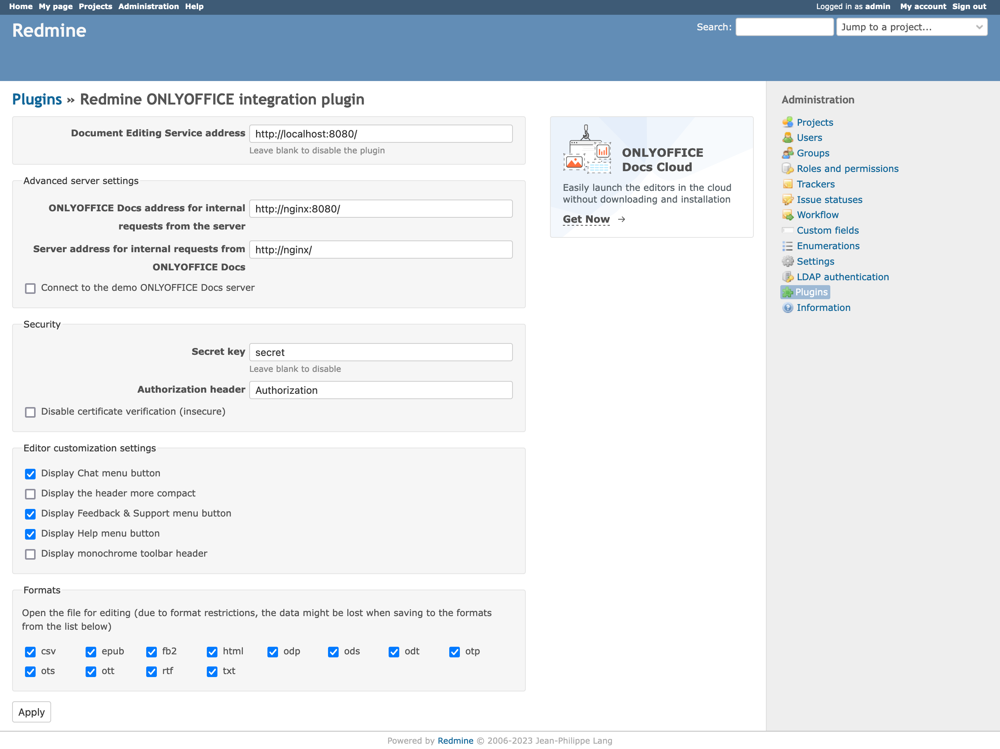

</details>

### General Settings

- Document Editing Service address. \
  The URL of the installed ONLYOFFICE Docs (Document Server). Leave blank to disable the plugin.

### Advanced Server Settings

- ONLYOFFICE Docs address for internal requests from the server.
- Server address for internal requests from ONLYOFFICE Docs.
- Connect to the demo ONLYOFFICE Docs server.

### Security

- Secret key. \
  JWT authentication is enabled by default and the secret key is generated automatically to restrict the access to ONLYOFFICE Docs and for security reasons and data integrity. If needed, specify your own secret key in the ONLYOFFICE Docs [config file](https://api.onlyoffice.com/docs/docs-api/additional-api/signature/), then specify the same key in the settings page of the plugin. Leave blank to disable authentication.
- Authorization header.
- Disable certificate verification (insecure).

### Editor customization settings

- Display Chat menu button.
- Display the header more compact.
- Display Feedback & Support menu button.
- Display Help menu button.
- Display monochrome toolbar header.

### Formats

- Specify the list of formats allowed to be opened directly for editing.

## How it works

The plugin uses the [ONLYOFFICE Docs API](https://api.onlyoffice.com/docs/docs-api/get-started/basic-concepts/) and is integrated into various Redmine pages, including [Documents](#documents), [Attachments](#attachment), [Files](#files), [Issues](#issues), [News](#news), [Wiki](#wiki), and [Forums](#forums).

Additionally, the plugin adds general pages such as ["Create in ONLYOFFICE"](#create-in-onlyoffice) and ["Convert in ONLYOFFICE"](#convert-in-onlyoffice).

### Documents

<details>
  <summary>Show Documents page</summary>

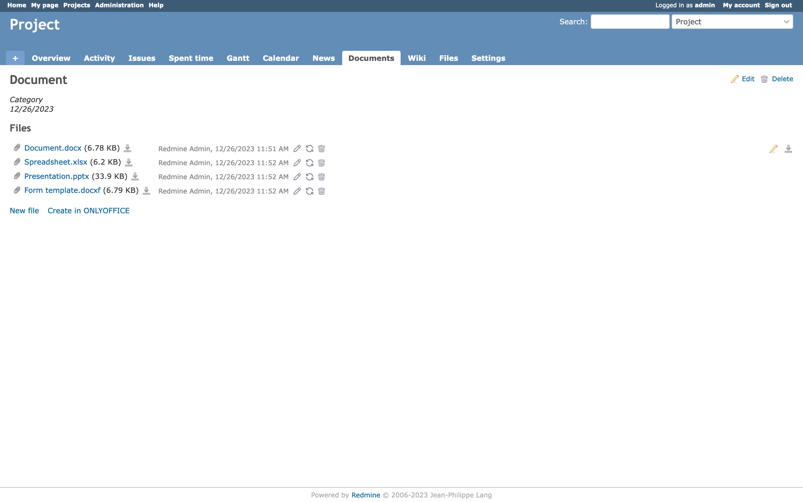

</details>

On the Documents page, users can open the attachment to view, edit, create, or convert it. The options displayed in the interface may vary depending on the user permissions.

| Option            | Permissions                    |
| ----------------- | ------------------------------ |
| View              | View documents                 |
| Edit              | View documents, Edit documents |
| Create            | View documents, Edit documents |
| Convert: Save     | View documents, Edit documents |
| Convert: Download | View documents                 |

### Attachment

<details>
  <summary>Show Attachment page</summary>

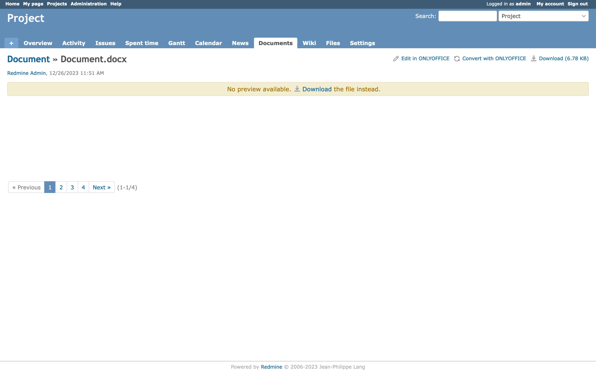

</details>

On the Attachment page, users can open the attachment to view, edit, or convert it. The options displayed in the interface may vary depending on the user's permissions for the module where the attachment is located.

### Files

<details>
  <summary>Show Files page</summary>

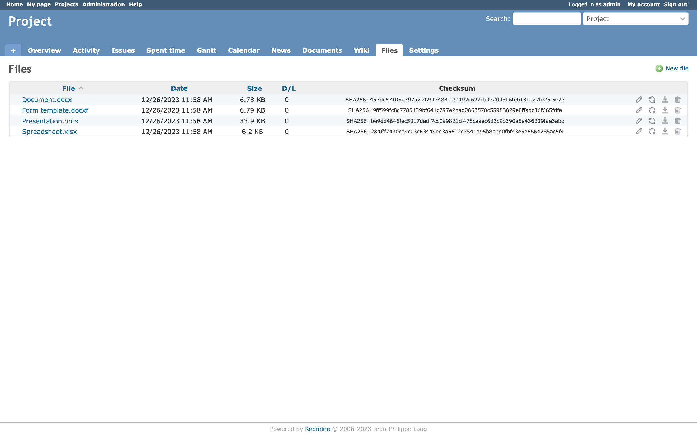

</details>

On the Files page, users can open the attachment to view, edit, or convert it. The options displayed in the interface may vary depending on the user's permissions.

| Option            | Permissions              |
| ----------------- | ------------------------ |
| View              | View files               |
| Edit              | View files, Manage files |
| Convert: Save     | View files, Manage files |
| Convert: Download | View files               |

### Issues

<details>
  <summary>Show Issue page</summary>

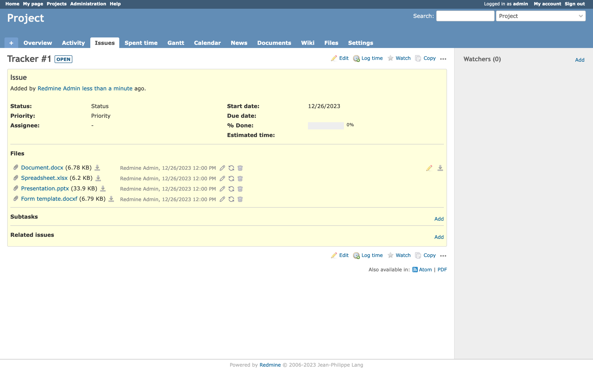

</details>

On the Issue page, users can open the attachment to view, edit, or convert it. The options displayed in the interface may vary depending on the user's permissions.

| Option            | Permissions                  |
| ----------------- | ---------------------------- |
| View              | View issues                  |
| Edit              | View issues, Edit own issues |
| Convert: Save     | View issues, Edit own issues |
| Convert: Download | View issues                  |

### News

<details>
  <summary>Show News page</summary>

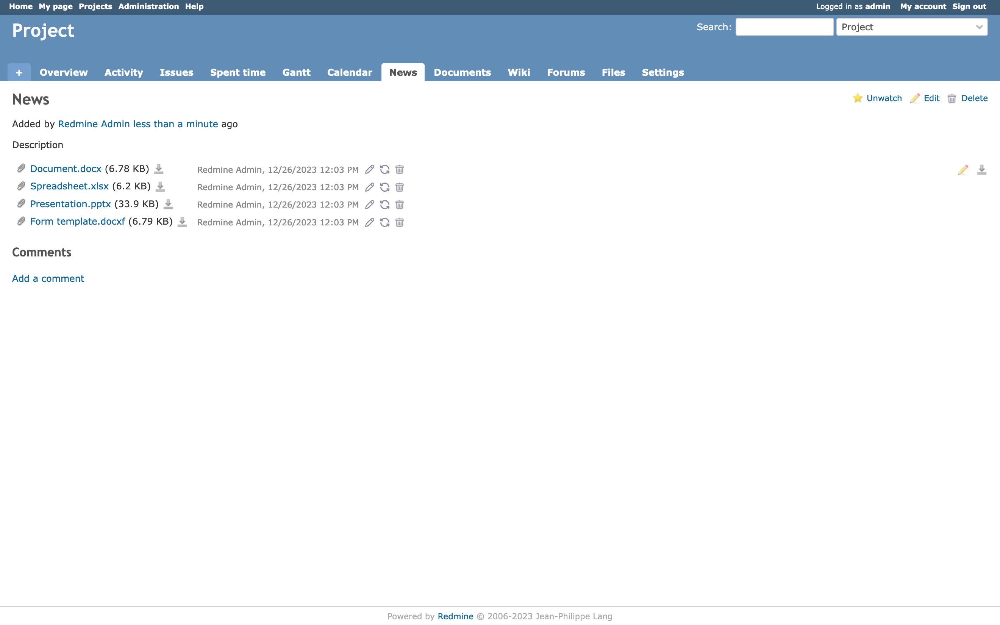

</details>

On the News page, users can open the attachment to view, edit, or convert it. The options displayed in the interface may vary depending on the user's permissions.

| Option            | Permissions            |
| ----------------- | ---------------------- |
| View              | View news              |
| Edit              | View news, Manage news |
| Convert: Save     | View news, Manage news |
| Convert: Download | View news              |

### Wiki

<details>
  <summary>Show Wiki page</summary>

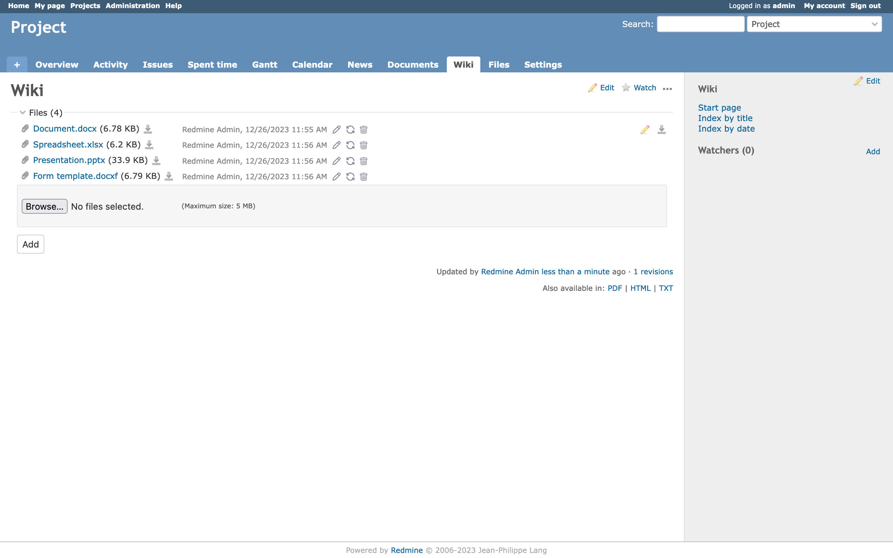

</details>

On the Wiki page, users can open the attachment to view, edit, or convert it. The options displayed in the interface may vary depending on the user's permissions.

| Option            | Permissions                |
| ----------------- | -------------------------- |
| View              | View wiki                  |
| Edit              | View wiki, Edit wiki pages |
| Convert: Save     | View wiki, Edit wiki pages |
| Convert: Download | View wiki                  |

### Forums

<details>
  <summary>Show Forums page</summary>

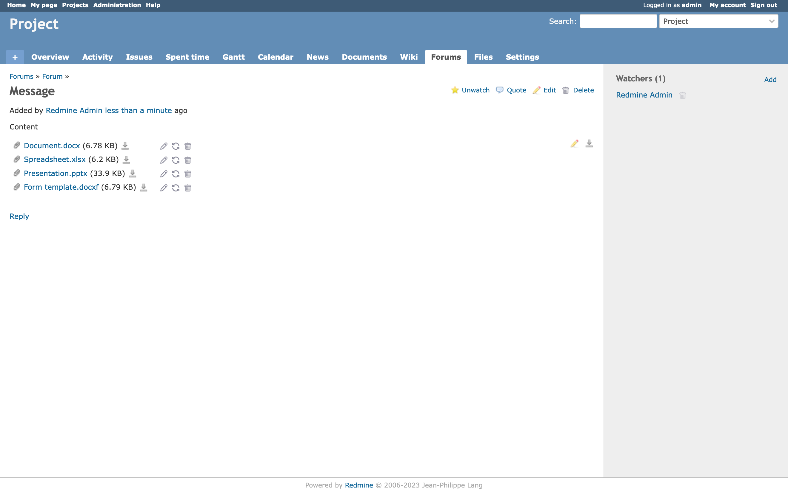

</details>

On the Forums page, users can open the attachment to view, edit, or convert it. The options displayed in the interface may vary depending on the user's permissions.

| Option            | Permissions                  |
| ----------------- | ---------------------------- |
| View              | View messages                |
| Edit              | View messages, Edit messages |
| Convert: Save     | View messages, Edit messages |
| Convert: Download | View messages                |

### View Or Edit In ONLYOFFICE

<details>
  <summary>Show editor page</summary>

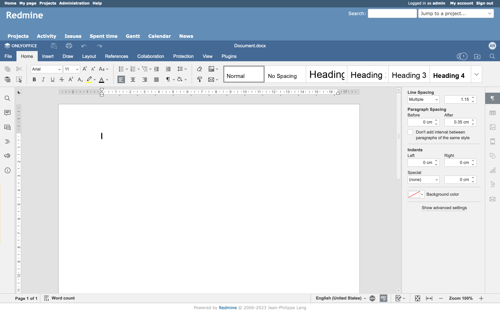

</details>

On the "View Or Edit In ONLYOFFICE" page, users can view or edit the attachment. The visibility of this page depends on the user's permissions for the module where the attachment is located.

### Create In ONLYOFFICE

<details>
  <summary>Show create page</summary>

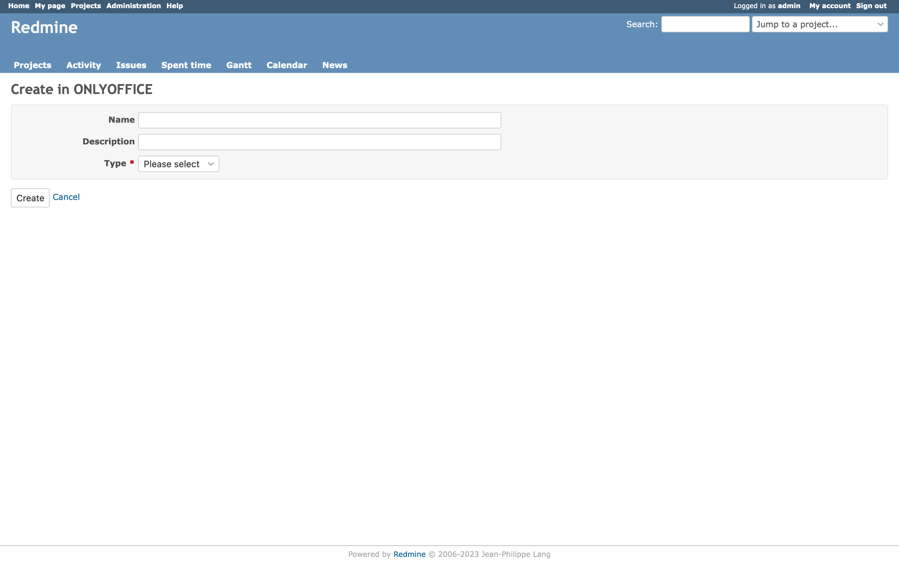

</details>

On the "Create In ONLYOFFICE" page, users can create the attachment using templates that consider the user's language preference. Take a look at [supported formats](#supported-formats). The visibility of this page depends on the user's permissions for the module.

### Convert In ONLYOFFICE

<details>
  <summary>Show convert page</summary>

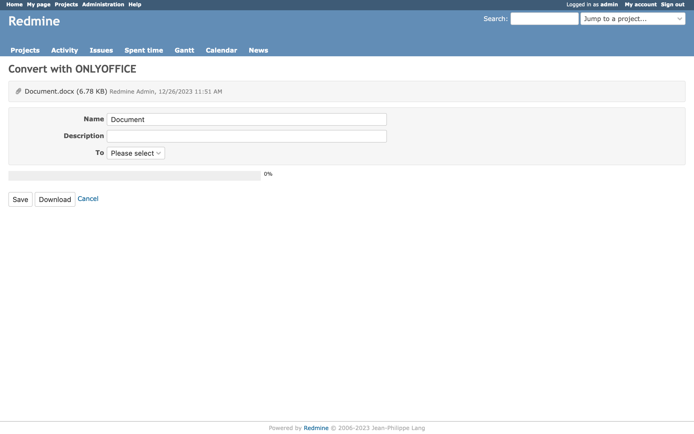

</details>

On the "Convert In ONLYOFFICE" page, the user can convert the attachment. The visibility of this page depends on the user's permissions for the module where the attachment is located.

## ONLYOFFICE Docs Editions

ONLYOFFICE offers different versions of ONLYOFFICE Docs editors that can be deployed on your own servers:

* Community Edition 🆓 (`onlyoffice-documentserver` package)
* Enterprise Edition 🏢 (`onlyoffice-documentserver-ee` package)

The table below will help you to make the right choice.

| Pricing and licensing | Community Edition | Enterprise Edition |
| ------------- | ------------- | ------------- |
| | [Get it now](https://www.onlyoffice.com/download-community?utm_source=github&utm_medium=cpc&utm_campaign=GitHubRedmine#docs-community)  | [Start Free Trial](https://www.onlyoffice.com/download?utm_source=github&utm_medium=cpc&utm_campaign=GitHubRedmine#docs-enterprise)  |
| Cost  | FREE  | [Go to the pricing page](https://www.onlyoffice.com/docs-enterprise-prices?utm_source=github&utm_medium=cpc&utm_campaign=GitHubRedmine)  |
| Number of users | up to 20 recommended | As in chosen pricing plan |
| License | GNU AGPL v.3 | Proprietary |
| **Support** | **Community Edition** | **Enterprise Edition** |
| Documentation | [Help Center](https://helpcenter.onlyoffice.com/docs/installation/community) | [Help Center](https://helpcenter.onlyoffice.com/docs/installation/enterprise) |
| Standard support | [GitHub](https://github.com/ONLYOFFICE/DocumentServer/issues) or [Community](https://community.onlyoffice.com/) | 1 or 3 years support included |
| Premium support | [Contact us](mailto:sales@onlyoffice.com) | [Contact us](mailto:sales@onlyoffice.com) |
| **Services** | **Community Edition** | **Enterprise Edition** |
| Conversion Service                | + | + |
| Live Viewer                       | + | + |
| Document Builder Service          | - | - |
| Automation API                    | - | - |
| **Interface** | **Community Edition** | **Enterprise Edition** |
| Tabbed interface                  | + | + |
| Dark theme                        | + | + |
| 125%, 150%, 175%, 200% scaling    | + | + |
| White Label                       | - | - |
| Integrated test example (node.js) | + | + |
| Admin Panel                       | - | + |
| Mobile web editors                | - | +* |
| **Plugins & Macros** | **Community Edition** | **Enterprise Edition** |
| Plugins                           | + | + |
| Macros                            | + | + |
| **Collaborative capabilities** | **Community Edition** | **Enterprise Edition** |
| Two co-editing modes              | + | + |
| Comments                          | + | + |
| Built-in chat                     | + | + |
| Review and tracking changes       | + | + |
| Display modes of tracking changes | + | + |
| Version history                   | + | + |
| **Document Editor features** | **Community Edition** | **Enterprise Edition** |
| Font and paragraph formatting   | + | + |
| Object insertion                | + | + |
| Adding Content control          | + | + |
| Editing Content control         | + | + |
| Layout tools                    | + | + |
| Table of contents               | + | + |
| Navigation panel                | + | + |
| Mail Merge                      | + | + |
| Comparing documents             | + | + |
| Multipage View                  | + | + |
| **Spreadsheet Editor features** | **Community Edition** | **Enterprise Edition** |
| Font and paragraph formatting   | + | + |
| Object insertion                | + | + |
| Functions, formulas, equations  | + | + |
| Table templates                 | + | + |
| Pivot tables                    | + | + |
| Data validation                 | + | + |
| Conditional formatting          | + | + |
| Sparklines                      | + | + |
| Sheet Views                     | + | + |
| Solver                          | + | + |
| **Presentation Editor features** | **Community Edition** | **Enterprise Edition** |
| Font and paragraph formatting   | + | + |
| Object insertion                | + | + |
| Transitions                     | + | + |
| Animations                      | + | + |
| Presenter mode                  | + | + |
| Notes                           | + | + |
| Slide Master                    | + | + |
| **Form creator features** | **Community Edition** | **Enterprise Edition** |
| Adding form fields              | + | + |
| Form preview                    | + | + |
| Saving as PDF                   | + | + |
| Role-matching colors for fields | + | + |
| **PDF Editor features**      | **Community Edition** | **Enterprise Edition** |
| Text editing and co-editing                                | + | + |
| Work with pages (adding, deleting, rotating)               | + | + |
| Inserting objects (shapes, images, hyperlinks, etc.)       | + | + |
| Text annotations (highlight, underline, cross out, stamps) | + | + |
| Redact                          | + | + |
| Comments                        | + | + |
| Freehand drawings               | + | + |
| Form filling                    | + | + |
| | [Get it now](https://www.onlyoffice.com/download-community?utm_source=github&utm_medium=cpc&utm_campaign=GitHubRedmine#docs-community)  | [Start Free Trial](https://www.onlyoffice.com/download?utm_source=github&utm_medium=cpc&utm_campaign=GitHubRedmine#docs-enterprise)  |

\* If supported by DMS.

## Need help? User Feedback and Support 💡

* **🐞 Found a bug?** Please report it by creating an [issue](https://github.com/ONLYOFFICE/onlyoffice-redmine/issues).
* **❓ Have a question?** Ask our community and developers on the [ONLYOFFICE Forum](https://community.onlyoffice.com).
* **👨‍💻 Need help for developers?** Check our [API documentation](https://api.onlyoffice.com).